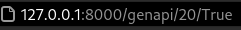
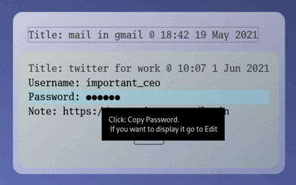

#Last Project for CS50's Web Programming with Python and Javascript.

Demonstration:
https://youtu.be/1NiM1BO5aiU

##Why I believe is distinct and complex requirements.
This project is more difficult than the others, because it uses a self-created python generator in the backend,
which works in real time with the front end.
This makes the project more reactive when the user enters an input.

Additionally, most of the site is CSS reactive to the user movements, making it more intuitive and easy to read.
This site use HTML, CSS, Bootstrap, Python and Javascript, every language is pushed one step forward to get a better
site.

SafeApp is an app where you can generate and save logins and passwords from your on line accounts or real life.
You can run this in your personal computer and store the passwords locally, without involving an online server.
- Use API, you can get a json response at genapi/<int>/<str>, where <int> is the length of your password, 
  and <str> is for special symbols. example: this address 
  
  ask for a 20 characters length password with symbols, and you get as json response:
  
  
- An intelligent way to generate passwords from python.
- Is totally responsive to the user. Have a different custom javascript for give the specific functionality to each 
  section.
- Glass effect for the entire site with css.

##How every section works and the files inside of it.
- ####NavBar:
  
  
  `This is the Upper navigation bar, its sticked for all the other sections, allowing navigate to each section from any section.
  Have his own javascript file for more responsivity to the buttons, so you can see in which section you are surfing.
  `
  - base.html
  - base.js
  - styles.css

- ####Login / Register
  
  
  
  `It has the standard autentication from django, in two differents/separate pages.`
  - login.html
  - register.html
  
- ####Main Page
  
  
  `In this section you can visualizate all your entries, it show the title and the date,
  if you want to see it, you have to click it. When the entry is deployed, with just a click you can copy the username
  the password. For security the passsword is cover with six rounds characters, if you want to visualizate the passwors
  you have to go to the edit view. 
  it use the index.js file for fetch all your passwords and insert it to index.html. Also javascript show and hide the entries.`
  - index.html
  - index.js
  
- ####Generate / Save passwords
  
  
  
  `Have a slide where you can move to select the appropiate length of your random password.
  In the left have the number of the characters of the password, and in the right, a checkbox for include symbols in your password.
  You can add a note for the entry. You complete the fields in generate.html, for the password generator,
  generator.js make the call to passwgen.py in the backend.`
  - generate.html
  - generator.js
  - passwgen.py

- ####Profile
  
  
  `Here is where you can see your stat, entri numbers. 
  Also you can export your database to your computer or delete your profile, with all your passwords.
  This section use the prifile.js to create the dialog when you want to delete your profile.`
  - profile.html
  - profile.js
  
  
####All the others files are the normal django files or are pictures to this readme.

###Requirements:

- Django

###Setup:
Make sure you have installed python.
Clone the github repository.
In the root folder, run:
pip install -r requirements.txt

###Running the app:
In the root folder:
python manage.py makemigrations safeapp
python manage.py migrate
python manage.py createsuperuser (follow the instructions)
python manage.py runserver
then go to your browser and goto:
127.0.0.1:8000
you can create a new user or continue using the superuser

##Description
It has three main sections:

### Passwords Section

This is the main page, where you can visualize all your stored entries.
By default your entries are hidden and just the title and date are shown. You can click them and it will display the rest of the information.
At the bottom of every entry, there's a edit option, where you can actually edit your entry.

###Generator Section

Here is where you can develop the new entries for your database. The fields are:

Title: (mandatory) Whats the general name of your entry ie: gmail

Username: weareequals@gmail.com

Password: (mandatory) Here is the real feature of the app, you can generate a strong password for your account in an interactive way. So the best way to manage your accounts is having this open while you are creating the account.

Notes: Any special note that you want to put, ie: account valid until 1/1/2023.

[comment]: <> (![pass]&#40;safeapp/static/passwords.gif&#41;)

###Profile Section

Here you can visualize your username, the number of passwords.
It also has the option to export the database to text file so you can store locally or print it.
And you can delete your account, after a confirmation dialog.
These two options are next to the other, because if you want to emigrate, you do it easily here.

##Usage
Every time you need a password, go to 127.0.0.1:8000, clearly before you have to activate the local server in the terminal (python manage.py runserver). If you manage multiple accounts you will need to leave a tab open so you can have a better management of your database.
You use the Application by creating an user, then go and start generating entries for your record.

Superuser:

Lets you administrate all the database from the dango interface.
django admin interface:
127.0.0.1:8000/admin

##Donate
Monero

8AWD9jQ1Enngz9KhzcS7zwJ1YcYJ82VdaGFT57uvZJqsNjMHzYwnS13XeXSPikXFUtf5i15pUEUYngWM1iFHUzkbUTPmSCS

